Spectral extraction from a singe order transit timeseries data
==========

In the present notebook, we will extract spectra from a single order transit timeseries data. 
We will use WASP-39 transit timeseries data obtained with NIRCam/JWST for Transiting Exoplanet 
Community Early Release Science (ERS) program. All data products can be found on the 
`MAST portal <https://mast.stsci.edu/portal/Mashup/Clients/Mast/Portal.html>`_: this contains raw 
uncalibrated data (files with :code:`uncal.fits` extension), calibrated data (:code:`rateints.fits` 
and :code:`calints.fits`) and even spectrum timeseries data (:code:`x1dints.fits`). Here we will 
use :code:`rateints.fits` files to extract spectrum (see, the documentation of the 
`jwst <https://jwst-pipeline.readthedocs.io/en/latest/index.html>`_ pipeline to know more). 
We downloaded all files and put them in the same directory as this notebook.

We first need to "correct" this data for NaN values, 0s and cosmic rays, which will be our first task. 
We can then perform a background subtraction. Finally we will extract a spectrum timeseries from this 
dataset.

.. code-block:: python

    import numpy as np
    import matplotlib.pyplot as plt
    import os
    from stark import SingleOrderPSF, optimal_extract, reduce
    from astropy.stats import mad_std
    from glob import glob
    from astropy.io import fits
    from tqdm import tqdm
    from path import Path
    from scipy.optimize import curve_fit as cft
    from mpl_toolkits.axes_grid1 import make_axes_locatable
    import warnings

Loading the dataset
-------------------

Since the data volume is too big, the data products are delievered in segments. For WASP-39 NIRCam data, 
there are 4 segments. We first load data in all 4 segments and put them in a single numpy array below. The 
data in each segment contains several hundreads of individual exposures, or, frames. Each frame has a :code:`data` array, an :code:`error` array,
a :code:`dq` (data quality, i.e., bad-pixel map) array and a :code:`time` array. We will extract all 4 types
of information from each frame.

.. code-block:: python

    visit = 'NRCLW'

    # Input and Output paths
    p1 = os.getcwd()
    if not Path(p1 + '/Figures').exists():
        os.mkdir(p1 + '/Figures')

    ## Segments!!!
    segs = ['00' + str(i+1) for i in range(4)]

    # For 1st segment
    ## Loading the .fits file
    fhdul = glob(p1 + '/*seg001_nrcalong_rateints.fits')[0]
    hdul = fits.open(fhdul)
    ## 1, 2 and 3rd products are data, errors and bad-pixel map, respectively
    raw_data, raw_err, dq, time_bjd = hdul[1].data, hdul[2].data, hdul[3].data, hdul[4].data['int_mid_BJD_TDB']
    ## All values >0 in bad pixel maps are "bad"; we create a simpler bad-pixel map here,
    # 0 means bad pixel and 1 means a good pixel (the same convention used by stark)
    mask = np.ones(dq.shape)
    mask[dq > 0] = 0.

    # Repeating the same for the other segments
    for i in range(len(segs)-1):
        fhdul = glob(p1 + '/*seg' + segs[i+1] + '_nrcalong_rateints.fits')[0]
        hdul = fits.open(fhdul)
        # Data
        raw_data = np.vstack((raw_data, hdul[1].data))
        # Errors
        raw_err = np.vstack((raw_err, hdul[2].data))
        # DQ
        dq, m1 = hdul[3].data, np.ones(hdul[1].data.shape)
        m1[dq>0] = 0.
        mask = np.vstack((mask, m1))
        # Times
        time_bjd = np.hstack((time_bjd, hdul[4].data['int_mid_BJD_TDB']))

    time_bjd = time_bjd + 2400000.5
    nint = np.random.randint(0, raw_data.shape[0])

Correcting the dataset
----------------------

Although the data that we gathered above is a calibrated data, we still need to perform additional checks
to this dataset, looking for 0s and NaN, for instance. 0s and NaN values in error arrays will specially be 
painful since we aim to use error array as weighting while fitting a PSF. So, let's first correct for 0s and
NaN from the error array. We will, additionally, consider these pixels as "bad" and add them to the default
bad-pixel map.

.. code-block:: python

    ## Correct errorbars
    print('>>>> --- Correcting errorbars (for zeros and NaNs)...')
    med_err = np.nanmedian(raw_err.flatten())
    ## Changing Nan's and zeros in error array with median error
    corr_err1 = np.copy(raw_err)
    corr_err2 = np.where(raw_err != 0., corr_err1, med_err)
    corrected_errs = np.where(np.isnan(raw_err) != True, corr_err2, med_err)
    print('>>>> --- Done!!')

    print('>>>> --- Updating the bad-pixel map...')
    ## Making a bad-pixel map (1s are good pixels, 0s are bad pixels)
    mask_bp1 = np.ones(raw_data.shape)
    mask_bp2 = np.where(raw_err != 0., mask_bp1, 0.)               # This will place 0 in mask where errorbar == 0
    mask_bp3 = np.where(np.isnan(raw_err) != True, mask_bp2, 0.)   # This will place 0 in mask where errorbar is Nan
    mask_badpix = mask * mask_bp3     # Adding those pixels which are identified as bad by the pipeline (and hence 0)
    print('>>>> --- Done!!')

.. code-block:: bash

    >>>> --- Correcting errorbars (for zeros and NaNs)...
    >>>> --- Done!!
    >>>> --- Updating the bad-pixel map...
    >>>> --- Done!!

Our data will be contaminated with a lot of cosmic rays, we want to identify those pixels and add them 
to our bad pixel map. Our method of identifying cosmic rays is pretty simple: we will generate a median 
dataframe, and compare this median frame with all frames. Since cosmic rays are outliers, we should be 
able to identify them by comparing each frame with a median frame. We further want to correct these 
values by taking mean of neighbouring pixels. 

.. code-block:: python

    def identify_crays(frames, mask_bp, clip=5, niters=5):
        """Given a data cube and bad-pixel map, this function identifies cosmic rays by using median frame"""
        # Masking bad pixels as NaN
        mask_cr = np.copy(mask_bp)
        for _ in range(niters):
            # Flagging bad data as Nan
            frame_new = np.copy(frames)
            frame_new[mask_cr == 0.] = np.nan
            # Median frame
            with warnings.catch_warnings():
                warnings.simplefilter('ignore', RuntimeWarning)
                median_frame = np.nanmedian(frame_new, axis=0)  # 2D frame
                # Creating residuals
                resids = frame_new - median_frame[None,:,:]
                # Median and std of residuals
                med_resid, std_resid = np.nanmedian(resids, axis=0), np.nanstd(resids, axis=0)
            limit = med_resid + (clip*std_resid)
            mask_cr1 = np.abs(resids) < limit[None,:,:]
            mask_cr = mask_cr1*mask_bp
        return mask_cr

    def replace_nan(data, max_iter = 50):
        """Replaces NaN-entries by mean of neighbours.
        Iterates until all NaN-entries are replaced or
        max_iter is reached. Works on N-dimensional arrays.
        """
        nan_data = data.copy()
        shape = np.append([2*data.ndim], data.shape)
        interp_cube = np.zeros(shape)
        axis = tuple(range(data.ndim))
        shift0 = np.zeros(data.ndim, int)
        shift0[0] = 1
        shift = []     # Shift list will be [(-1, 0), (1, 0), (0, -1), (0, 1)]
        for n in range(data.ndim):
            shift.append(tuple(np.roll(-shift0, n)))
            shift.append(tuple(np.roll(shift0, n)))
        for _j in range(max_iter):
            for n in range(2*data.ndim):
                interp_cube[n] = np.roll(nan_data, shift[n], axis = axis)   # interp_cube would be (4, data.shape[0], data.shape[1]) sized array
            with warnings.catch_warnings():                                 # with shifted position in each element (so that we can take its mean)
                warnings.simplefilter('ignore', RuntimeWarning)
                mean_data = np.nanmean(interp_cube, axis=0)
            nan_data[np.isnan(nan_data)] = mean_data[np.isnan(nan_data)]
            if np.sum(np.isnan(nan_data)) == 0:
                break
        return nan_data

    ## Mask with cosmic rays
    ### Essentially this mask will add 0s in the places of bad pixels...
    print('>>>> --- Identifying cosmic rays and updating the bad-pixel map...')
    mask_bcr = identify_crays(raw_data, mask_badpix)
    print('Total per cent of masked points:\
        {:.4f} %'.format(100 * (1 - np.sum(mask_bcr) / (mask_bcr.shape[0] * mask_bcr.shape[1] * mask_bcr.shape[2]))))
    print('>>>> --- Done!!')

    # And interpolating the data in bad-pixels with mean of neighbouring pixels
    print('>>>> --- Correcting data...')
    corrected_data_wo_bkg = np.copy(raw_data)
    corrected_data_wo_bkg[mask_bcr == 0] = np.nan
    for i in range(corrected_data_wo_bkg.shape[0]):
        corrected_data_wo_bkg[i,:,:] = replace_nan(corrected_data_wo_bkg[i,:,:])
    print('>>>> --- Done!!')

.. code-block:: bash

    >>>> --- Identifying cosmic rays and updating the bad-pixel map...
    Total per cent of masked points:      5.4090 %
    >>>> --- Done!!
    >>>> --- Correcting data...
    >>>> --- Done!!

Let's now visualise our data -- we will display one randomly selected frame below:

.. code-block:: python

    plt.figure(figsize=(15,5))
    plt.imshow(corrected_data_wo_bkg[nint,4:,:], interpolation='none', aspect='auto')
    plt.title('Example data frame')

It looks good! So, there are 256 rows (spatial direction) and 2048 columns (dispersion direction). 
The location of the trace is clearly seen. Let's plot the value of flux for a given column:

.. code-block:: python

    plt.figure(figsize=(15,5))
    plt.plot(corrected_data_wo_bkg[nint,:,500])
    plt.ylim([-2.5,2.5])
    plt.axhline(0., color='k')
    plt.xlabel('Row number')
    plt.ylabel('Counts')
    plt.title('Flux level in an arbitrary column of an arbitrary integration')

It is evident that the flux values in the background are not exactly zero. So, we need to perform a 
background subtraction.

Background subtraction
----------------------

We will perform background subtraction in both column and row direction. `stark` has functions to do 
this. Along the column, we will fit a linear polynomial to the background pixels for each column and 
then subtract the estimated background from each pixels. On the other hand, we will simply take median 
of background pixels along the row direction to estimate the background and then subtract that value 
from all pixels along the row.

We need to define the background region for that. Roughly looking at example data frame above, all 
rows above 80th row and 1750th column are basically background. So, we will define our mask in such 
a way:

.. code-block:: python

    msk_bkg = np.ones(corrected_data_wo_bkg[nint,:,:].shape)
    msk_bkg[0:80,0:1750] = 0.

    plt.figure(figsize=(15,5))
    plt.imshow(msk_bkg, interpolation='none')
    plt.title('Background mask')

And, below we do background subtraction using **:code:`stark`** functions :code:`stark.reduce.polynomial_bkg_cols` 
(for a background subtraction along columns) and :code:`stark.reduce.row_by_row_bkg_sub` (along the row).

.. code-block:: python

    corrected_data_bkg = np.ones(corrected_data_wo_bkg.shape)
    sub_bkg_col = np.ones(corrected_data_wo_bkg.shape)
    for i in tqdm(range(corrected_data_wo_bkg.shape[0])):
        corrected_data_bkg[i,:,:], sub_bkg_col[i,:,:] =\
            reduce.polynomial_bkg_cols(corrected_data_wo_bkg[i,:,:], mask=msk_bkg*mask_bcr[i,:,:], deg=1, sigma=5)

    corrected_data = np.ones(corrected_data_wo_bkg.shape)
    sub_bkg_row = np.ones((corrected_data_wo_bkg.shape[0], corrected_data_wo_bkg.shape[1]))
    for i in tqdm(range(corrected_data.shape[0])):
        corrected_data[i,:,:], sub_bkg_row[i,:] = \
            reduce.row_by_row_bkg_sub(corrected_data_bkg[i,:,:], mask=msk_bkg*mask_bcr[i,:,:])

    plt.figure(figsize=(15,5))
    plt.imshow(sub_bkg_col[nint,:,:], cmap='plasma', interpolation='none')
    plt.title('Subtracted background along the column for an arbitrary frame')

    plt.figure(figsize=(15,5))
    plt.imshow(sub_bkg_row[nint,:,None] * np.ones(corrected_data[nint,:,:].shape), cmap='plasma', interpolation='none')
    plt.title('Subtracted background along the row for an arbitrary frame')

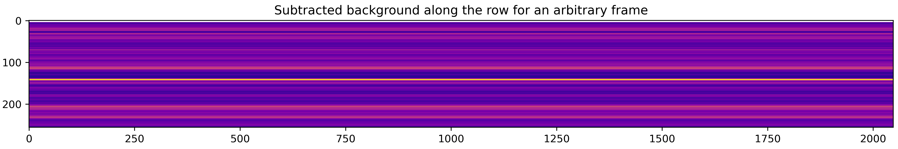

Tracing the spectra
-------------------

The first step of the spectral extraction is to find the trace positions -- we will use 
center-of-flux method to find location of spectral trace at each wavelength column for every time 
integration.

.. code-block:: python

    def quadratic(x, a, b, c):
        return a*(x**2) + b*x + c

    def jitter(x, jit):
        return x + jit

    # Finding trace
    def trace_pos(data, xstart, xend, ystart, yend):
        """Given a data frame and starting location, this function will find trace using centre-of-flux method"""
        xpos = np.arange(xstart, xend, 1)
        rough_trace = np.zeros((data.shape[0], len(xpos)))
        for i in tqdm(range(data.shape[0])):
            frame = data[i,:,:]
            row = np.arange(frame.shape[0])
            centre = np.sum(frame[ystart:yend,:]*row[ystart:yend, None], axis=0) / \
                np.maximum(np.sum(frame[ystart:yend,:], axis=0), 1)
            rough_trace[i,:] = centre[xstart:xend]
        median_rough_trace = np.nanmedian(rough_trace, axis=0)
        # Fitting a quadratic function to this
        popt, pcov = cft(quadratic, xpos, median_rough_trace)
        median_trace = quadratic(xpos, *popt)
        # And we will now fit jitter to each integration
        dx = np.zeros(data.shape[0])
        for i in tqdm(range(data.shape[0])):
            popt, _ = cft(jitter, rough_trace[i,:], median_trace)
            dx[i] = popt[0]
        return xpos, median_trace, dx

    xpos, trace1, dx1 = trace_pos(corrected_data[:,4:,:], 40, 1600, 25, 35)
    ypos2d = np.zeros((corrected_data.shape[0], len(xpos)))
    for i in range(ypos2d.shape[0]):
        ypos2d[i,:] = trace1 + dx1[i]

    plt.figure(figsize=(15,5))
    plt.imshow(corrected_data[nint,4:,:], interpolation='none', aspect='auto')
    plt.plot(xpos, trace1, 'k-')
    plt.ylim([50,0])
    plt.title('Example data with the location of spectral trace')

What we plot above is the median trace location -- on the top of this there should be a jitter of 
trace as a function of time. Let's plot that jitter below:

.. code-block:: python

    plt.figure(figsize=(15,5))
    plt.plot(np.arange(len(dx1)), dx1, 'k-')
    plt.xlabel('Integration number')
    plt.ylim([-0.007, 0.007])
    plt.ylabel('Jitter')

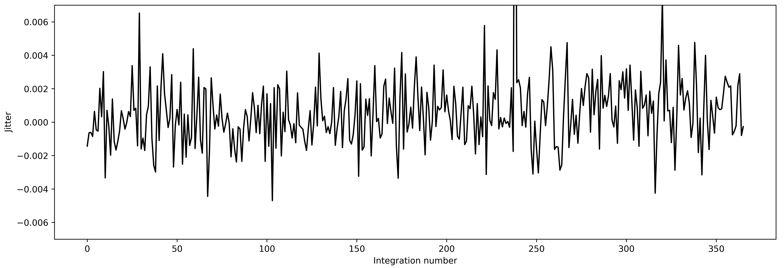

The trace looks more or less stable, the average jitter is at around 0.004 pixels -- that is very good! 
So, we will use these trace positions to identify the location of trace on data.

Initial estimate of PSF
-----------------------

We mentioned above that while PSF would not change with time, it will change significantly with 
wavelength. So, we want to fit a 2D spline to get a robust estimate of PSF. However, before doing 
that, let's approximate that the PSF doesn't change with wavelength. This assumption can give us a 
first rough estimate of stellar spectra which we can use as normalisation constant in next step.

So, let's fit 1D spline to the data as a function of spatial coordinate, i.e., distance from trace. 
In :code:`stark` we first create a :code:`stark` data object using :code:`SingleOrderPSF` class which 
will load data. This class will take the data, variance, masked pixels, aperture half-widths and trace 
locations as inputs. Note that the :code:`SingleOrderPSF` takes 3D arrays as data, variance and 
masked pixels with dimensions of (nFrames, nRows, nCols) assuming the trace run along the row. 
Similarly trace locations are a 2D array giving trace positions for each integration (nFrames, 
TraceLocations).

Once we load the data, we can fit a 1D spline using :code:`univariate_psf_frame` method, which will 
return PSF frame and best-fitted spline object.

.. code-block:: python

    data1d = SingleOrderPSF(frame=corrected_data[:,4:,xpos[0]:xpos[-1]+1],\
                            variance=corrected_errs[:,4:,xpos[0]:xpos[-1]+1]**2,\
                            ord_pos=ypos2d, ap_rad=9., mask=mask_bcr[:,4:,xpos[0]:xpos[-1]+1])
    psf_frame1d, psf_spline1d, _ = data1d.univariate_psf_frame(niters=3, oversample=2, clip=10000)

    # Details of the data, in form of a pixel table (see, API) is stored in data.norm_array
    ts1 = np.linspace(np.min(data1d.norm_array[:,0]), np.max(data1d.norm_array[:,0]), 1000)
    msk1 = np.asarray(data1d.norm_array[:,4], dtype=bool)
    plt.figure(figsize=(16/1.5, 9/1.5))
    plt.errorbar(data1d.norm_array[msk1,0], data1d.norm_array[msk1,1], fmt='.')
    plt.plot(ts1, psf_spline1d(ts1), c='k', lw=2., zorder=10)
    plt.xlabel('Distance from the trace')
    plt.ylabel('Normalised flux')
    plt.savefig('1dspline.png', dpi=500)

.. code-block:: bash

    Iter 1 / 3: 1.90234 per cent masked.
    Iter 2 / 3: 1.90234 per cent masked.
    Iter 3 / 3: 1.90234 per cent masked.

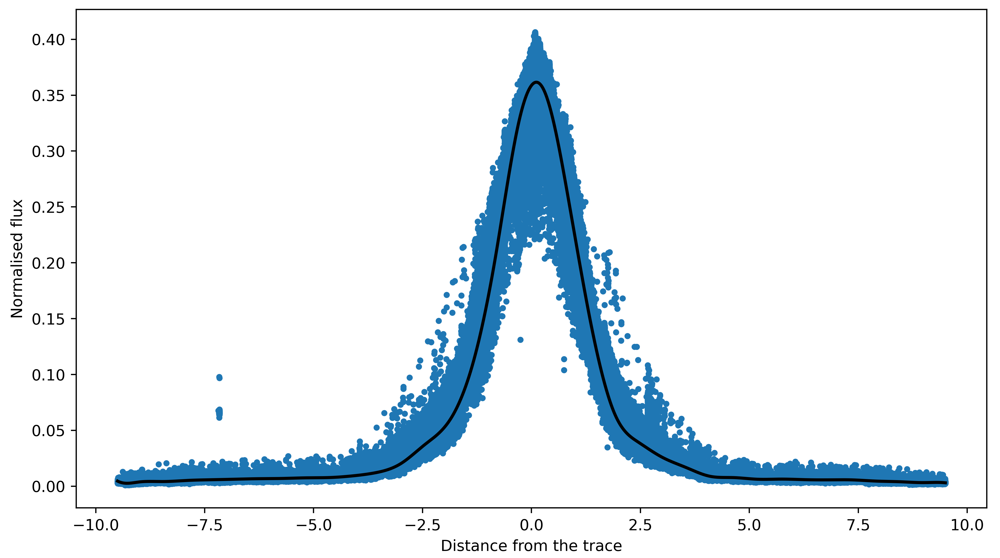

Nice! Above plot shows all data points (in blue) as a function of distance from trace and black line 
is the best-fitted PSF. As a first estimate this is looking very good. Let's now use this PSF to find t
imeseries of stellar spectra using :code:`optimal_extract` function.

(The third return variable which we did not save above while doing :code:`data1.univariate_psf_frame` is 
updated mask returned by the function. When we fit a spline to the data, it will identify outliers points 
beyond our preferred clipping limit -- :code:`clip` argument -- and add them to the mask. Along with the PSF 
frame and the spline object, :code:`univariate_psf_frame` (and also the :code:`bivariate_psf_frame`, see below) functions
will return this mask in form of pixel table. Users can use :code:`data1d.table2frame` function to get 
back a 2D updated mask.

This type of sigma clipping is usually useful to identify cosmic rays. In this example, however, we used a 
different method to identify cosmic rays (see, above), so we do not need to perform a sigma clipping here again.
That is why we used :code:`clip=10000` to essentially perform no sigma clipping. See, Tutorial 2 for more information on this.)

.. code-block:: python

    spec1d, var1d = np.zeros((psf_frame1d.shape[0], psf_frame1d.shape[2])), np.zeros((psf_frame1d.shape[0], psf_frame1d.shape[2]))
    syth1d = np.zeros(psf_frame1d.shape)
    for inte in tqdm(range(spec1d.shape[0])):
        spec1d[inte,:], var1d[inte,:], syth1d[inte,:,:] = optimal_extract(psf_frame=psf_frame1d[inte,:,:],\
                                                                          data=corrected_data[inte,4:,xpos[0]:xpos[-1]+1],\
                                                                          variance=corrected_errs[inte,4:,xpos[0]:xpos[-1]+1]**2,\
                                                                          mask=mask_bcr[inte,4:,xpos[0]:xpos[-1]+1],\
                                                                          ord_pos=ypos2d[inte,:], ap_rad=9.)

We now have a first estimate of timeseries of stellar spectra. We can use this as a normalising spectra 
in the next step.

Robust estimate of PSF
----------------------

As already mentioned, while PSF doesn't change much with time, it does change with wavelength. 
So, our above approximation of assuming a constant PSF with wavelength was not good. To take care 
of this, we will now assume that PSF changes with wavelength and we will fit a 2D spline to the data 
as a function of spatial direction and wavelength. To do so, we will first load the data as previously, 
but now we will provide initial estimate of spectra to use it as a normalising constant.

After loading the data we will use :code:`bivariate_psf_frame` method to fit 2D spline to this data:

.. code-block:: python

    data2 = SingleOrderPSF(frame=corrected_data[:,4:,xpos[0]:xpos[-1]+1],\
                           variance=corrected_errs[:,4:,xpos[0]:xpos[-1]+1]**2,\
                           ord_pos=ypos2d, ap_rad=9., mask=mask_bcr[:,4:,xpos[0]:xpos[-1]+1],\
                           spec=spec1d)
    psf_frame2d, psf_spline2d = data2.bivariate_psf_frame(niters=3, oversample=2, knot_col=10, clip=10000)

.. code-block:: bash

    /Users/japa6985/opt/anaconda3/envs/jwst/lib/python3.9/site-packages/scipy/interpolate/fitpack2.py:1272: UserWarning: 
    The coefficients of the spline returned have been computed as the
    minimal norm least-squares solution of a (numerically) rank deficient
    system (deficiency=55). If deficiency is large, the results may be
    inaccurate. Deficiency may strongly depend on the value of eps.
    warnings.warn(message)
    Iter 1 / 3: 1.90234 per cent masked.
    Iter 2 / 3: 1.90234 per cent masked.
    Iter 3 / 3: 1.90234 per cent masked.

Before finding the time-series of spectra, let's see how we well we fit the splines. For this, we will 
visualise data and fitted splines for one given colum.

.. code-block:: python

    # Details are not that important:
    # But what we are trying to do below is to find data from an arbitrary column for _all_ integration
    # And then we will see how the fitted 2D spline behaves to this data

    ncol1 = np.random.choice(xpos)  # Arbitrary column number
    msk5 = data2.col_array_pos[:,ncol1,0]     # Mask data
    npix1 = data2.col_array_pos[:,ncol1,1]    # Pixel radius data

    xpoints = np.array([])     # To save x (pixel coordinate), y (column no), z (flux)
    ypoints = np.array([])
    zpoints = np.array([])
    for i in range(len(msk5)):
        xdts = data2.norm_array[msk5[i]:msk5[i]+npix1[i],0]
        ydts = data2.norm_array[msk5[i]:msk5[i]+npix1[i],3]
        zdts = data2.norm_array[msk5[i]:msk5[i]+npix1[i],1]
        msk_bad = np.asarray(data2.norm_array[msk5[i]:msk5[i]+npix1[i],4], dtype=bool)
        xdts, ydts, zdts = xdts[msk_bad], ydts[msk_bad], zdts[msk_bad]
        xpoints = np.hstack((xpoints, xdts))
        ypoints = np.hstack((ypoints, ydts))
        zpoints = np.hstack((zpoints, zdts))

    # Creating a continuous grid of points
    xpts1 = np.linspace(np.min(xpoints)-0.1, np.max(xpoints)+0.1, 1000)
    ypts1 = np.ones(1000)*ypoints[0]

    fits_2d = psf_spline2d(xpts1, ypts1, grid=False)

    plt.figure(figsize=(16/1.5,9/1.5))
    plt.errorbar(xpoints, zpoints, fmt='.')
    plt.plot(xpts1, fits_2d, 'k-')
    plt.plot(xpoints, psf_spline2d(xpoints, ypoints, grid=False), 'k.')
    plt.axvline(0., color='k', ls='--')
    plt.title('All frames, for Column ' + str(ncol1))
    plt.xlabel('Distance from the trace')
    plt.ylabel('Normalised flux')

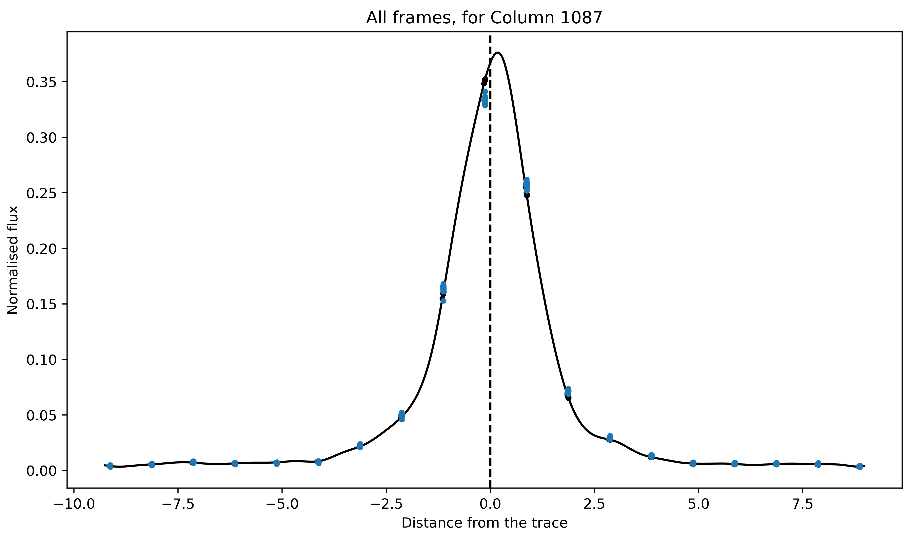

The blue and black (barely visible) points are original data points and their estimated value based on 
the best fitted spline (black line). The fitted spline is slightly asymmetric but that is okay. 
Overall, we did a good job.

Now, we mentioned that the main reason to use 2D splines was that the PSF was not constant as a 
function of wavelength. So, let's now see how PSF (i.e., its amplitude and FWHM) changes with wavelength.

.. code-block:: python

    # Defining pixel coordinates
    pix_cor_res = 50000
    pix_corr = np.linspace(-8., 8., pix_cor_res)

    cols = xpos - xpos[0]
    max_amp = np.zeros(len(cols))
    fwhm = np.zeros(len(cols))

    for i in range(len(cols)):
        fit2 = psf_spline2d(x=pix_corr, y=np.ones(pix_cor_res)*cols[i], grid=False)
        # Maximum amplitude
        max_amp[i] = np.max(fit2)
        # Maximum amplitude location
        idx_max_amp = np.where(fit2 == np.max(fit2))[0][0]
        # fwhm
        hm = (np.max(fit2) + np.min(fit2))/2
        idx_hm = np.where(np.abs(fit2 - hm)<0.005)[0]
        idx_hm_up, idx_hm_lo = 0, 0
        diff_up1, diff_lo1 = 10., 10.
        for j in range(len(idx_hm)):
            if idx_hm[j] > idx_max_amp:
                diff_u1 = np.abs(fit2[idx_hm[j]] - hm)
                if diff_u1 < diff_up1:
                    diff_up1 = diff_u1
                    idx_hm_up = idx_hm[j]
            else:
                diff_l1 = np.abs(fit2[idx_hm[j]] - hm)
                if diff_l1 < diff_lo1:
                    diff_lo1 = diff_l1
                    idx_hm_lo = idx_hm[j]
        fwhm[i] = np.abs(pix_corr[idx_hm_up] - pix_corr[idx_hm_lo])

    fig, axs = plt.subplots(2, 1, figsize=(15, 5), sharex=True, facecolor='white')

    axs[0].plot(xpos, max_amp, 'k-')
    axs[0].set_ylabel('Maximum Amplitude', fontsize=14)

    axs[1].plot(xpos, fwhm, 'k-')
    axs[1].set_ylabel('FWHM', fontsize=14)
    axs[1].set_xlabel('Column number', fontsize=14)

    axs[1].set_xlim([xpos[0], xpos[-1]])

    axs[0].set_title('PSF evolution with wavelength', fontsize=15)

    plt.setp(axs[0].get_yticklabels(), fontsize=12)
    plt.setp(axs[1].get_xticklabels(), fontsize=12)
    plt.setp(axs[1].get_yticklabels(), fontsize=12)

    plt.tight_layout()

Both the amplitude and FWHM is a bit wiggly. This maybe because we used `oversample=2` while fitting 
the 2D spline. When we do this, we put 2 times more knots in the spatial direction, and this could 
make PSF more noisy (or, more wiggly). One can use `oversample=1` (the default option) which would 
put 1 knot per pixel -- while this could "stablise" the PSF, its fitting to the data will not be 
as good. Ideally, one should use `oversample=1` and then repeat this whole procedure iteratively. 
But, for our purposes, using `oversample=2` is okay.

Aperture half-width selection
-----------------------------

Now, we want to use this PSF to extract the stellar spectra. Until now, we were using aperture 
half-width of 9 pixels to fit the splines and to extract the spectra. And that is totally fine. 
However, it could be possible that by changing the aperture half-width one could get a lower scatter 
in the final white-light lightcurve. So, what we will do below is to extract spectra for a series 
of aperture half-widths from 2 to 9 pixels. After spectral extraction we will compute a white-light 
lightcurve by taking weighted average of all spectroscopic lightcurves (i.e., flux as a function 
of time for each wavelengths). Finally, we will compute the MAD of this lightcurve and compare it 
with MAD value of white-light lightcurves found with different apertures. We will select the aperture 
with minimum MAD on white-light lightcurve.

.. code-block:: python

    apertures = np.arange(2,10,1)
    scatter = np.zeros(len(apertures))

    for aps in range(len(apertures)):
        spec1d, var1d = np.zeros((psf_frame2d.shape[0], psf_frame2d.shape[2])), np.zeros((psf_frame2d.shape[0], psf_frame2d.shape[2]))
        syth1d = np.zeros(psf_frame2d.shape)
        for inte in tqdm(range(spec1d.shape[0])):
            spec1d[inte,:], var1d[inte,:], syth1d[inte,:,:] = optimal_extract(psf_frame=psf_frame2d[inte,:,:],\
                                                                            data=corrected_data[inte,4:,xpos[0]:xpos[-1]+1],\
                                                                            variance=corrected_errs[inte,4:,xpos[0]:xpos[-1]+1]**2,\
                                                                            mask=mask_bcr[inte,4:,xpos[0]:xpos[-1]+1],\
                                                                            ord_pos=ypos2d[inte,:], ap_rad=apertures[aps])
        # Computing white-light lightcurve
        wht_lc = np.nansum(spec1d/var1d, axis=1) / np.nansum(1/var1d, axis=1)
        # And its scatter
        scatter[aps] = mad_std(wht_lc/np.nanmedian(wht_lc)) * 1e6

    plt.figure(figsize=(15,5))
    plt.plot(apertures, scatter, 'k-')
    plt.xlabel('Aperture half-width')
    plt.ylabel('MAD of white-light lightcurve')

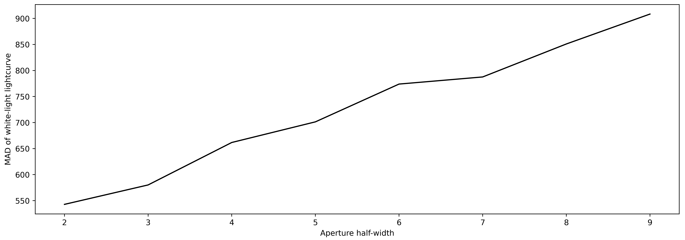

Optimal extraction of the spectral timeseries
---------------------------------------------

Perfect! We now have an optimal aperture size. We will use this aperture size to extract spectra again:

.. code-block:: python

    min_scat_ap = apertures[np.argmin(scatter)]

    spec1d, var1d = np.zeros((psf_frame2d.shape[0], psf_frame2d.shape[2])), np.zeros((psf_frame2d.shape[0], psf_frame2d.shape[2]))
    syth1d = np.zeros(psf_frame2d.shape)
    for inte in tqdm(range(spec1d.shape[0])):
        spec1d[inte,:], var1d[inte,:], syth1d[inte,:,:] = optimal_extract(psf_frame=psf_frame2d[inte,:,:],\
                                                                          data=corrected_data[inte,4:,xpos[0]:xpos[-1]+1],\
                                                                          variance=corrected_errs[inte,4:,xpos[0]:xpos[-1]+1]**2,\
                                                                          mask=mask_bcr[inte,4:,xpos[0]:xpos[-1]+1],\
                                                                          ord_pos=ypos2d[inte,:], ap_rad=min_scat_ap)

Let's plot all spectra (or, spectral timeseries) on the top of each other:

.. code-block:: python

    plt.figure(figsize=(15,5))
    for i in range(spec1d.shape[0]):
        plt.plot(xpos, spec1d[i,:], 'k', alpha=0.1)
    plt.xlabel('Column number')
    plt.ylabel('#')
    plt.title('Timeseries of spectra')

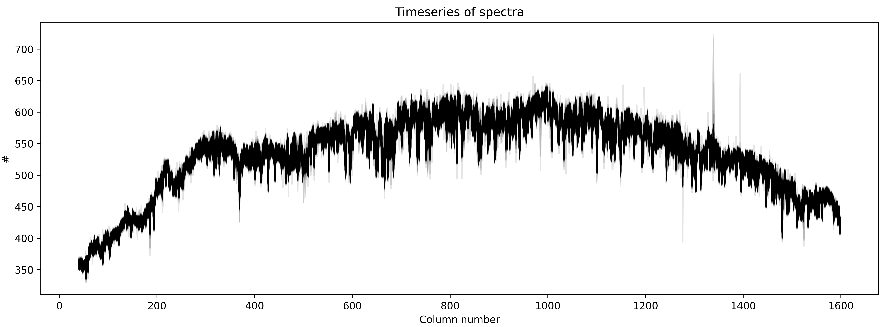

Good! The scatter (or the width) that we see above is because the level of flux changes during the 
transit event.

Residual frame
--------------

When we fit 2D spline to the data, we are basically modelling the trace. So, in principle, we do 
spectral extraction, we should have a synthetic model of the data. Indeed, we were saving this model 
for each time when we performed spectral extraction using :code:`optimal_extract` function. We can subtract 
this sythetic model from our dataset to find what is called residual frame. Ideally, this frame should 
look like a white-noise. If not there is some left-over noise in the data or spline fitting was not 
perfect. 

In any case the median residual frame should show us the static leftover noise that was not fitted. 
If one find any such noise one can subtract this median residual frame from our original data and 
repeat the whole procedure of spline fitting until there remains only white noise in the median 
residual frame.

So, now, let's see how the median residual frame looks like:

.. code-block:: python

    resid1 = np.zeros(syth1d.shape)
    for j in range(resid1.shape[0]):
        resid1[j,:,:] = corrected_data[j,4:,xpos[0]:xpos[-1]+1] - syth1d[j,:,:]

    med_resid = np.nanmedian(resid1, axis=0)

    plt.figure(figsize=(15,5))
    im = plt.imshow(med_resid, interpolation='none')#, aspect='auto')
    im.set_clim([-5,5])
    plt.xlim([0,315])
    plt.ylim([20,40])
    plt.title('Median residual frame')

    plt.figure(figsize=(15,5))
    im = plt.imshow(med_resid, interpolation='none')#, aspect='auto')
    im.set_clim([-5,5])
    plt.xlim([315,2*315])
    plt.ylim([20,40])

    plt.figure(figsize=(15,5))
    im = plt.imshow(med_resid, interpolation='none')#, aspect='auto')
    im.set_clim([-5,5])
    plt.xlim([2*315, 3*315])
    plt.ylim([20,40])

    plt.figure(figsize=(15,5))
    im = plt.imshow(med_resid, interpolation='none')#, aspect='auto')
    im.set_clim([-5,5])
    plt.xlim([3*315, 4*315])
    plt.ylim([20,40])

    plt.figure(figsize=(15,5))
    im = plt.imshow(med_resid, interpolation='none')#, aspect='auto')
    im.set_clim([-5,5])
    plt.xlim([4*315, 5*315])
    plt.ylim([20,40])

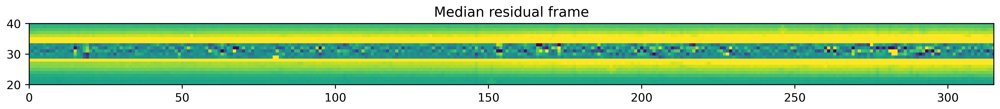

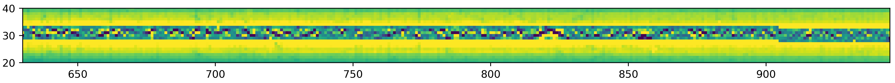

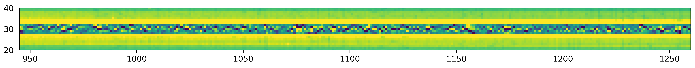

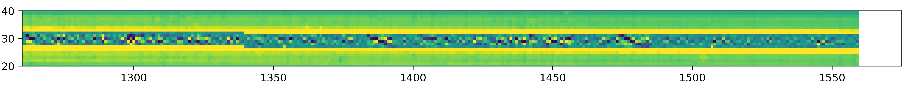

Ahh good! Maybe there is some structure in these image -- but for the purpose of this analysis, 
we can safely assume that this is just some white-noise. Interested reader can subtract this median 
residual image from each dataframe and repeat the whole procedure of spline fitting again. That would 
definately remove any leftover static noise.

Lightcurves
-----------

Now, we will compute white-light lightcurve by taking a weighted average of spectroscopic lightcurves 
(i.e., timeseries of flux at each wavelength).

.. code-block:: python

    wht_light_lc = np.nansum(spec1d/var1d, axis=1) / np.nansum(1/var1d, axis=1)
    wht_light_err = 1/np.sqrt(np.nansum(1/var1d, axis=1))

    plt.figure(figsize=(15,5))
    plt.errorbar(time_bjd, wht_light_lc/np.nanmedian(wht_light_lc), \
                yerr=wht_light_err/np.nanmedian(wht_light_lc), fmt='.', c='k')
    plt.title('White-light lightcurve, MAD: {:.4f} ppm'.format(mad_std(wht_light_lc/np.nanmedian(wht_light_lc)) * 1e6))
    plt.xlabel('Time (BJD)')
    plt.ylabel('Relative flux')
    plt.savefig('white_lc.png', dpi=500)

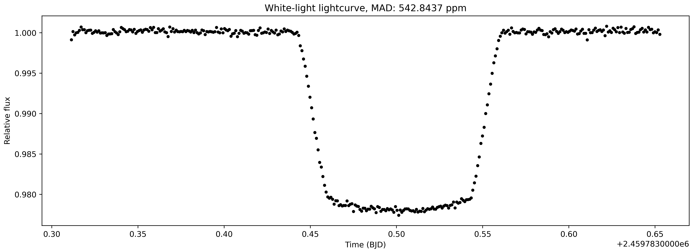

This is interesting! Probably the cleanest light curve one might have ever seen. This is a raw light curve but 
one cannot spot any obvious systematics. Let's also visualise spectroscopic light curves, i.e., light curves
computed for each column:

.. code-block:: python

    per, tc = 4.05527892, 2456401.39763
    cycle = round((time_bjd[0] - tc) / per)
    tc1 = tc + (cycle * per)
    times_hours = (time_bjd - tc1) * 24

    norm_lcs = np.zeros(spec1d.shape)
    for i in range(norm_lcs.shape[1]):
        norm_lc1 = spec1d[:,i] / np.nanmedian(spec1d[:,i])
        norm_lcs[:,i] = (norm_lc1 - 1)*1e6

    fig, ax1 = plt.subplots(figsize=(10, 10))

    # Data
    im1 = ax1.imshow(np.abs(norm_lcs), interpolation='none', cmap='plasma', aspect = 'auto')
    im1.set_clim(100,15000)
    plt.xlabel('Column Number', fontsize = 15)
    plt.ylabel('Time from $T_c$ (hours)', fontsize = 15)

    # X axis:
    ticks = np.arange(0, len(xpos), 250)
    ticklabels = ["{:0.0f}".format(xpos[i]) for i in ticks]
    ax1.set_xticks(ticks)
    ax1.set_xticklabels(ticklabels, fontsize=14)

    # Y axis:
    ticks = np.arange(0, len(time_bjd), 123)
    ticklabels = ["{:.1f}".format(times_hours[i]) for i in ticks]
    ax1.set_yticks(ticks)
    ax1.set_yticklabels(ticklabels, fontsize=14)

    # Colorbar:
    divider = make_axes_locatable(ax1)
    cax = divider.append_axes("right", size="5%", pad=0.05)

    cbar = fig.colorbar(im1, shrink = 0.08, cax=cax)
    cbar.ax.tick_params(labelsize=14)
    cbar.ax.get_yaxis().labelpad = 20
    cbar.ax.set_ylabel('ppm', rotation=270, fontsize = 15)

    plt.savefig('2dtrans_spec.png', dpi=500)

