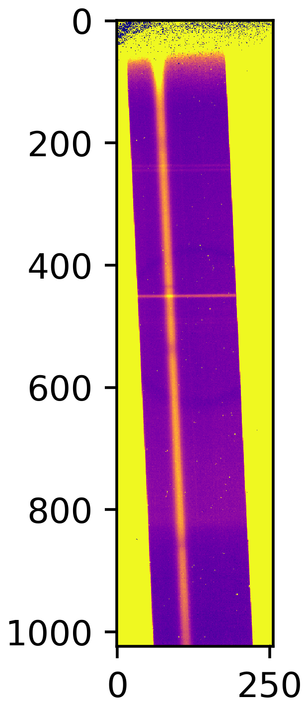

Spectral extraction of a single order spectrum
==========

In this notebook, we will extract a stellar spectrum from a single order non-timeseries data 
from Phoenix instrument on Gemini (South) telescope. It is a low resolution spectrograph. 
The data is taken on October 5, 2009 for WASP-7 and downloaded from Gemini archive. 
The specific data file used for this tutorial can be downloaded from here.

The data is already reduced in the sense that it is corrected for dark current and flat 
fielding. However, we will perform a background subtraction and correcting for 0s and NaN 
before extracting the spectrum.

.. code-block:: python

    import numpy as np
    import matplotlib.pyplot as plt
    from stark import SingleOrderPSF, optimal_extract, reduce, aperture_extract
    from astropy.stats import mad_std
    from astropy.io import fits
    from tqdm import tqdm
    from scipy.optimize import curve_fit as cft
    from scipy.ndimage import median_filter

Loading the dataset
-------------------

Let's first load the data. The data is a single frame containting the flux, 
uncertainties and bad-pixel map. However, the default bad-pixel map that they provide 
is "bad" itself, so we will generate a bad-pixel map ourselvs. 
Let's first visualise the data:

.. code-block:: python

    hdul = fits.open('2009oct25_0007_corr.fits')
    data, error = hdul[0].data, hdul[2].data

    plt.figure(figsize=(5/1.5,15/1.5))
    im = plt.imshow(data, interpolation='none', cmap='plasma')
    im.set_clim([0,100])
    plt.title('The data frame')

Correcting the data and background subtraction
----------------------------------------------

Good! So, we can clearly see the spectrum -- note that the dispersion direction is 
vertical. So, we have to rotate the dataframe, since **:code:`stark` assumes that the 
dispersion direction is horizontal, i.e., along the rows**. The yellow region near the 
edge is the region outside of the slit. We will neglect/mask that region throughout our 
analysis.

Our first business is to get rid of all NaN snd 0s from the error array as they can 
mess up things! We will make a bad-pixel map with these pixels containing either 0 or NaN
in error array.

We then want to perform a background subtraction, but looks like the trace is not 
perpendicular to the row/column. So, it is hard to determine background region here. 
What we will do is, we will first trace the location of the spectrum using centre of 
flux method, and then we can say that all pixels that are N pixels away from the trace are 
background pixels.

.. code-block:: python

    # Rotating the data and error frame -----
    data, error = np.transpose(data), np.transpose(error)

    ## Correct errorbars -------
    print('>>>> --- Correcting errorbars (for zeros and NaNs)...')
    med_err = np.nanmedian(error.flatten())
    ## Changing Nan's and zeros in error array with median error
    corr_err1 = np.copy(error)
    corr_err2 = np.where(error != 0., corr_err1, med_err)
    corrected_errs = np.where(np.isnan(error) != True, corr_err2, med_err)
    print('>>>> --- Done!!')

    print('>>>> --- Updating the bad-pixel map...')
    ## Making a bad-pixel map (1s are good pixels, 0s are bad pixels)
    mask_bp1 = np.ones(data.shape)
    mask_bp2 = np.where(error != 0., mask_bp1, 0.)               # This will place 0 in mask where errorbar == 0
    mask_badpix = np.where(np.isnan(error) != True, mask_bp2, 0.)   # This will place 0 in mask where errorbar is Nan
    print('>>>> --- Done!!')

    # Visualising the spectrum
    plt.figure(figsize=(15,5))
    im = plt.imshow(mask_badpix, interpolation='none', cmap='plasma')
    plt.title('Bad pixel map')

    # Tracing the spectrum ------
    def line(x, m, c):
        return m*x + c

    # Finding trace
    def trace_pos(data, xstart, xend, ystart, yend):
        """Given a data frame and starting location, this function will find trace 
        by fitting a line to the finding maximum along the row in the dataset"""
        xpos = np.arange(xstart, xend, 1)
        trace1 = np.argmax(data[ystart:yend,xstart:xend], axis=0)
        # Fitting a linear function to this
        popt, _ = cft(line, xpos, trace1)
        median_trace = line(xpos, *popt)
        return xpos, median_trace + ystart

    xpos, trace = trace_pos(data, 100, 1000, 60, 150)

    # Visualising the spectrum
    plt.figure(figsize=(15,5))
    im = plt.imshow(data, interpolation='none', cmap='plasma')
    plt.plot(xpos, trace, 'k-', lw=2.)
    im.set_clim([0,100])
    plt.title('The data frame with the location of the trace')

.. code-block:: bash

    >>>> --- Correcting errorbars (for zeros and NaNs)...
    >>>> --- Done!!
    >>>> --- Updating the bad-pixel map...
    >>>> --- Done!!

Okay, we can now determine the background region as all pixels that are at least 
20 pixels away from the trace in both direction and at maximum 45 pixels away to the 
"above" side and 100 pixels away to the "down" side (note that the trace in not in the 
middle).

.. code-block:: python

    idx_arr_r, _ = np.meshgrid(np.arange(data.shape[0]), np.arange(data.shape[1]))
    idx_arr_r = np.transpose(idx_arr_r)

    dist_from_trace = np.zeros(data.shape)
    dist_from_trace[:, 100:1000] = idx_arr_r[:, 100:1000]-trace[None,:]

    bkg_msk = np.zeros(data.shape)
    bkg_msk[(dist_from_trace > 20)&(dist_from_trace<100)] = 1.
    bkg_msk[(dist_from_trace<-20)&(dist_from_trace>-45)]=1.

    plt.figure(figsize=(15,5))
    im2 = plt.imshow(data, interpolation='none', cmap='plasma', zorder=0)
    im = plt.imshow(bkg_msk, interpolation='none', alpha=0.5, zorder=10)#, cmap='plasma')
    plt.plot(xpos, trace, 'k-', lw=2.)
    im2.set_clim([0,100])
    plt.title('Data frame, location of the trace and background region')

.. figure:: T2/bkg_reg.png
    :alt: Background region on the top of the data frame

The background region is illustrated above. Let's now perform a column-by-column background 
subtraction. We will fit a linear polynomial to all background pixels in a given column 
to estimate the background level and then subtract the estimated background from all pixels. 
:code:`stark` has a function to do this: :code:`reduce.polynomial_bkg_cols`:

.. code-block:: python

    bkg_corr_data, sub_image = reduce.polynomial_bkg_cols(data, bkg_msk, deg=1)

    plt.figure(figsize=(15,5))
    im = plt.imshow(sub_image, interpolation='none', cmap='plasma')
    plt.title('Subtracted background')
    im.set_clim([0,100])

Aperture extraction
-------------------

The aperture extraction, in which we simply sum up the values of flux inside the 
aperture to compute the spectrum, is the simplest way to estimate spectrum. However, 
if there are uncorrected cosmic rays (as in our case), the spectrum would have many outliers.
As a first guess of the spectrum this is good enough; we will improve upon this later.

.. code-block:: python

    ap_extract, var_ap = aperture_extract(data[:,100:1000], error[:,100:1000], trace, ap_rad=5)

    plt.figure(figsize=(15, 5))
    plt.plot(xpos, ap_extract, 'k-')
    plt.xlabel('Column number')
    plt.ylabel('Counts')

There are some outlier columns, mostly because of uncorrected cosmic rays. We can identify t
hose columns by performing a sigma clipping using a median filter. We will then replace 
flux values in those columns by median of neighbouring pixels. 

The reason for doing so is that this spectrum will be used as a normalising spectrum 
below before doing the spline fitting. Now, if we do not correct for those very-high-flux 
cosmic ray events then the flux and variance values in the normalised data will be abnormally 
low. A small variance means a high weighting given to those points, which is, of course, 
not correct.

.. code-block:: python

    # Median filter of the aperture extraction (we can make the window small, because the cosmics
    # usually affect only single column)
    med_filt_spec = median_filter(ap_extract, size=3)

    # Using 5 sigma clipping to find outliers
    resids = ap_extract - med_filt_spec
    limit = np.nanmedian(resids) + (10 * mad_std(resids))
    msk_outliers = np.abs(resids) < limit

    plt.figure(figsize=(15, 5))
    plt.plot(xpos, ap_extract, 'k-', label='Aperture extraction')
    plt.errorbar(xpos[~msk_outliers], ap_extract[~msk_outliers], fmt='.', c='orangered', label='Outliers')
    plt.plot(xpos, med_filt_spec, 'darkgreen', label='Median filter')
    plt.xlabel('Column number')
    plt.ylabel('Counts')
    plt.legend(loc='best')

Good! Almost all bad points are identified. What we can do now is replace the value of these 
bad points with a median of neighbouring pixels.

.. code-block:: python

    ap_extract_corrected = np.copy(ap_extract)

    for i in range(len(xpos)):
        if ~msk_outliers[i]:
            neigh = np.array([ap_extract[i-2], ap_extract[i-1], ap_extract[i+1], ap_extract[i+2]])
            ap_extract_corrected[i] = np.nanmedian(neigh)

    plt.figure(figsize=(15, 5))
    plt.plot(xpos, ap_extract, 'k-', label='Simple aperture extraction')
    plt.plot(xpos, ap_extract_corrected, 'r-', label='Corrected aperture extraction')
    plt.xlabel('Column number')
    plt.ylabel('Counts')
    plt.legend(loc='best')

Nice! We will use this corrected spectrum in our analysis now.

Initial estimate of PSF: fitting a 1D spline
--------------------------------------------

We will fit a 1D spline as a function of pixel coordinate (i.e., distance from the 
trace) to *all* data within the aperture. This should give us an initial estimate of the 
stellar PSF. In this process of fitting a 1D spline to the data, we can even identify 
"bad" pixels which are affected by cosmic rays with sigma clipping. We can then mask these 
points in our subsequent reduction.

By default, :code:`stark` assumes that the data provided to :code:`SingleOrderPSF` is a 
timeseries data with (ntimes, nrows, ncolumns) dimension. So, since our data is 
only a 2D frame data and not a timeseries data, we will re-shape our data products 
to make them "timeseries" with only one frame in it.

.. code-block:: python

    # Converting 2D frames to 3D timeseries
    data1 = bkg_corr_data.reshape(1, 256, 1024)
    err1 = corrected_errs.reshape(1, 256, 1024)
    ypos2d = trace.reshape(1,len(trace))
    corr_ap_ext = ap_extract_corrected.reshape(1,len(ap_extract_corrected))
    mask_badpix = mask_badpix.reshape(1, 256, 1024)

    # And fitting a 1D spline
    data1d = SingleOrderPSF(frame=data1[:,:,xpos[0]:xpos[-1]+1],\
                            variance=err1[:,:,xpos[0]:xpos[-1]+1]**2,\
                            mask=mask_badpix[:,:,xpos[0]:xpos[-1]+1],\
                            ord_pos=ypos2d, ap_rad=15., spec=corr_ap_ext)
    psf_frame1d, psf_spline1d, msk_updated_1d = data1d.univariate_psf_frame(niters=5, oversample=1, clip=5)

    ts1 = np.linspace(np.min(data1d.norm_array[:,0]), np.max(data1d.norm_array[:,0]), 1000)
    msk1 = np.asarray(data1d.norm_array[:,4], dtype=bool) * msk_updated_1d
    plt.figure(figsize=(16/1.5, 9/1.5))
    plt.errorbar(data1d.norm_array[msk1,0], data1d.norm_array[msk1,1], fmt='.')
    plt.plot(ts1, psf_spline1d(ts1), c='k', lw=2., zorder=10)
    plt.xlabel('Distance from the trace')
    plt.ylabel('Normalised flux')

.. code-block:: bash

    Iter 1 / 5: 0.04659 per cent masked.
    Iter 2 / 5: 0.08244 per cent masked.
    Iter 3 / 5: 0.08244 per cent masked.
    Iter 4 / 5: 0.08244 per cent masked.
    Iter 5 / 5: 0.08244 per cent masked.

I think this is very good PSF fitting (in black) for a first estimate. As can be seen, 
the PSF is very broad.

One of the products of :code:`SingleOrderPSF.univariate_psf_frame` is a mask containing 
all points discarded while performing sigma clipping during spline fiting. This mask is not 
in a format of 2D frame but rather in a form of "pixel table". The "pixel table" is an 
internal method to store data products. :code:`stark` has a function to convert the data 
from this "pixel table" to 2D frames that we can understand. We will add the points in 
this mask to our :code:`bad pixel map` and will not include in our further reduction.

.. code-block:: python

    msk_2d = data1d.table2frame(msk_updated_1d)
    mask_badpix_updated = np.copy(mask_badpix)
    mask_badpix_updated[:,:,xpos[0]:xpos[-1]+1] = mask_badpix[:,:,xpos[0]:xpos[-1]+1] * msk_2d

    plt.figure(figsize=(15,5))
    plt.imshow(mask_badpix_updated[0,:,:], interpolation='none', cmap='plasma')
    plt.title('Updated bad-pixel map')

And now, we will use this updated bad-pixel map to extract the spectrum below:

(Again, altogh there is only one frame in our data, we will continue to consider 
it as a "timeseries" because by default the :code:`SingleOrderPSF` class assumes that 
the data is in timeseries.)

.. code-block:: python

    spec1d, var1d = np.zeros((psf_frame1d.shape[0], psf_frame1d.shape[2])), np.zeros((psf_frame1d.shape[0], psf_frame1d.shape[2]))
    syth1d = np.zeros(psf_frame1d.shape)
    for inte in tqdm(range(spec1d.shape[0])):
        spec1d[inte,:], var1d[inte,:], syth1d[inte,:,:] = optimal_extract(psf_frame=psf_frame1d[inte,:,:],\
                                                                        data=data1[inte,:,xpos[0]:xpos[-1]+1],\
                                                                        variance=err1[inte,:,xpos[0]:xpos[-1]+1]**2,\
                                                                        mask=mask_badpix_updated[inte,:,xpos[0]:xpos[-1]+1],\
                                                                        ord_pos=ypos2d[inte,:], ap_rad=15.)

    spec_from1d = spec1d[0,:]
    plt.figure(figsize=(15, 5))
    plt.plot(xpos, spec1d[0,:], 'k-')
    plt.xlabel('Column number')
    plt.ylabel('Counts')

A good spectrum with almost no outliers! This is great! We can now use this spectrum and 
go for an estimation of even more robust PSF by fitting a 2D spline to the data. 

Robust estimate of the PSF: fitting a 2D spline
-----------------------------------------------

While fitting a 1D spline only as function of pixel coordinates can give a good 
estimate of the stellar PSF (and, the spectrum, subsequently), it may be a poor estimate 
of the PSF. The main assumption while fitting a 1D spline to the data is that the stellar 
PSF does not change with wavelength. This is, however, not true: the PSF changes 
significantly with wavelength. Therefore, we will fit a 2D spline to the data as a 
function of pixel-coordinate (i.e., distance from the trace) and wavelength. We will use 
the better estimate of stellar spectrum found above as a normalising constant in preparing 
the data.

.. code-block:: python

    data2 = SingleOrderPSF(frame=data1[:,:,xpos[0]:xpos[-1]+1],\
                           variance=err1[:,:,xpos[0]:xpos[-1]+1]**2,\
                           ord_pos=ypos2d, ap_rad=15., mask=mask_badpix_updated[:,:,xpos[0]:xpos[-1]+1],\
                           spec=spec1d)
    psf_frame2d, psf_spline2d, msk_after2d = data2.bivariate_psf_frame(niters=3, oversample=2, knot_col=10, clip=5)

.. code-block:: bash

    /Users/japa6985/opt/anaconda3/envs/jwst/lib/python3.9/site-packages/scipy/interpolate/fitpack2.py:1272: UserWarning: 
    The coefficients of the spline returned have been computed as the
    minimal norm least-squares solution of a (numerically) rank deficient
    system (deficiency=62). If deficiency is large, the results may be
    inaccurate. Deficiency may strongly depend on the value of eps.
    warnings.warn(message)
    Iter 1 / 3: 0.09677 per cent masked.
    Iter 2 / 3: 0.09677 per cent masked.
    Iter 3 / 3: 0.09677 per cent masked.

First, let's see how the best fitted PSF looks for an arbitrary column

.. code-block:: python

    # Details are not that important:
    # But what we are trying to do below is to find data from an arbitrary column for _all_ integration
    # And then we will see how the fitted 2D spline behaves to this data

    ncol1 = np.random.choice(xpos)  # Arbitrary column number
    msk5 = data2.col_array_pos[:,ncol1,0]     # Mask data
    npix1 = data2.col_array_pos[:,ncol1,1]    # Pixel radius data

    xpoints = np.array([])     # To save x (pixel coordinate), y (column no), z (flux)
    ypoints = np.array([])
    zpoints = np.array([])
    for i in range(len(msk5)):
        xdts = data2.norm_array[msk5[i]:msk5[i]+npix1[i],0]
        ydts = data2.norm_array[msk5[i]:msk5[i]+npix1[i],3]
        zdts = data2.norm_array[msk5[i]:msk5[i]+npix1[i],1]
        msk_bad = np.asarray(data2.norm_array[msk5[i]:msk5[i]+npix1[i],4], dtype=bool)
        xdts, ydts, zdts = xdts[msk_bad], ydts[msk_bad], zdts[msk_bad]
        xpoints = np.hstack((xpoints, xdts))
        ypoints = np.hstack((ypoints, ydts))
        zpoints = np.hstack((zpoints, zdts))

    # Creating a continuous grid of points
    xpts1 = np.linspace(np.min(xpoints)-0.1, np.max(xpoints)+0.1, 1000)
    ypts1 = np.ones(1000)*ypoints[0]

    fits_2d = psf_spline2d(xpts1, ypts1, grid=False)

    plt.figure(figsize=(16/1.5,9/1.5))
    plt.errorbar(xpoints, zpoints, fmt='.')
    plt.plot(xpts1, fits_2d, 'k-')
    plt.plot(xpoints, psf_spline2d(xpoints, ypoints, grid=False), 'k.')
    plt.axvline(0., color='k', ls='--')
    plt.title('For Column ' + str(ncol1))
    plt.xlabel('Distance from the trace')
    plt.ylabel('Normalised flux')

.. figure:: T2/2dspline.png
    :alt: Best-fitted 2D spline to an arbitrary column

Not bad! We above mentioned that the PSF will change with wavelength. Let's now see if 
this is indeed the case or not by computing amplitude and FWHM of the best-fitted PSF as 
a function of wavelength:

.. code-block:: python

    # Defining pixel coordinates
    pix_cor_res = 50000
    pix_corr = np.linspace(-8., 8., pix_cor_res)

    cols = xpos - xpos[0]
    max_amp = np.zeros(len(cols))
    fwhm = np.zeros(len(cols))

    for i in range(len(cols)):
        fit2 = psf_spline2d(x=pix_corr, y=np.ones(pix_cor_res)*cols[i], grid=False)
        # Maximum amplitude
        max_amp[i] = np.max(fit2)
        # Maximum amplitude location
        idx_max_amp = np.where(fit2 == np.max(fit2))[0][0]
        # fwhm
        hm = (np.max(fit2) + np.min(fit2))/2
        idx_hm = np.where(np.abs(fit2 - hm)<0.005)[0]
        idx_hm_up, idx_hm_lo = 0, 0
        diff_up1, diff_lo1 = 10., 10.
        for j in range(len(idx_hm)):
            if idx_hm[j] > idx_max_amp:
                diff_u1 = np.abs(fit2[idx_hm[j]] - hm)
                if diff_u1 < diff_up1:
                    diff_up1 = diff_u1
                    idx_hm_up = idx_hm[j]
            else:
                diff_l1 = np.abs(fit2[idx_hm[j]] - hm)
                if diff_l1 < diff_lo1:
                    diff_lo1 = diff_l1
                    idx_hm_lo = idx_hm[j]
        fwhm[i] = np.abs(pix_corr[idx_hm_up] - pix_corr[idx_hm_lo])

    fig, axs = plt.subplots(2, 1, figsize=(15, 5), sharex=True, facecolor='white')

    axs[0].plot(xpos, max_amp, 'k-')
    axs[0].set_ylabel('Maximum Amplitude', fontsize=14)

    axs[1].plot(xpos, fwhm, 'k-')
    axs[1].set_ylabel('FWHM', fontsize=14)
    axs[1].set_xlabel('Column number', fontsize=14)

    axs[1].set_xlim([xpos[0], xpos[-1]])

    axs[0].set_title('PSF evolution with wavelength', fontsize=15)

    plt.setp(axs[0].get_yticklabels(), fontsize=12)
    plt.setp(axs[1].get_xticklabels(), fontsize=12)
    plt.setp(axs[1].get_yticklabels(), fontsize=12)

    plt.tight_layout()

Aha! So, the PSF does change with wavelength. As can be seen, the FWHM of the PSF decreases 
significantlly with the wavelength (i.e., with column number). This is why fitting 1D 
spline without taking into account the wavelength information would give a poor estimate 
of the stellar PSF, and hence, the stellar spectrum. We will now use this robust estimate 
of the PSF to compute the spectrum. But before doing that, first, let's update the bad 
pixel map.

Similar to the :code:`univariate_psf_frame`, :code:`bivariate_psf_frame` also returns a 
mask in the format of pixel table as described above. We can update the mask as follows:

.. code-block:: python

    msk_2d2d = data2.table2frame(msk_after2d)
    mask_badpix_updated2d = np.copy(mask_badpix_updated)
    mask_badpix_updated2d[:,:,xpos[0]:xpos[-1]+1] = mask_badpix_updated[:,:,xpos[0]:xpos[-1]+1] * msk_2d2d

    plt.figure(figsize=(15,5))
    plt.imshow(mask_badpix_updated2d[0,:,:], interpolation='none', cmap='plasma')
    plt.title('Updated bad-pixel map')

And, now the spectrum,

.. code-block:: python

    spec1d, var1d = np.zeros((psf_frame2d.shape[0], psf_frame2d.shape[2])), np.zeros((psf_frame2d.shape[0], psf_frame2d.shape[2]))
    syth1d = np.zeros(psf_frame2d.shape)
    for inte in tqdm(range(spec1d.shape[0])):
        spec1d[inte,:], var1d[inte,:], syth1d[inte,:,:] = optimal_extract(psf_frame=psf_frame2d[inte,:,:],\
                                                                        data=data1[inte,:,xpos[0]:xpos[-1]+1],\
                                                                        variance=err1[inte,:,xpos[0]:xpos[-1]+1]**2,\
                                                                        mask=mask_badpix_updated2d[inte,:,xpos[0]:xpos[-1]+1],\
                                                                        ord_pos=ypos2d[inte,:], ap_rad=15)
        
    spec_from2d = spec1d[0,:]
    plt.figure(figsize=(15, 5))
    plt.plot(xpos, spec1d[0,:], 'k-')
    plt.xlabel('Column number')
    plt.ylabel('Counts')

Fantastic! Let's see how the spectrum changed from aperture extraction to this more 
robust extraction:

.. code-block:: python

    plt.figure(figsize=(15, 5))
    plt.plot(xpos, ap_extract_corrected, 'k-', label='Aperture extraction')
    plt.plot(xpos, spec_from1d, color='orangered', label='1D spline extraction')
    plt.plot(xpos, spec_from2d, color='dodgerblue', label='2D spline extraction')
    plt.xlabel('Column number')
    plt.ylabel('Counts')
    plt.legend(loc='best')

Nice! Finally, as a reduction diagnostic, let's have a look at the residual frame. 

The :code:`optimal_extract` function, in addition to the spectrum and variance, also 
returns a sythetic data frame. This frame is constructed from the estimate of PSF and the 
stellar spectrum. We can subtract this frame from the data frame and look for any remaining 
structures in the resultant residual frame. Any significant remaining structures in the 
residual frames indicates that the PSF fitting and extraction was not optimal.

.. code-block:: python

    resid = np.zeros(syth1d.shape)
    resid[0,:,:] = data1[0,:,xpos[0]:xpos[-1]+1] - syth1d[0,:,:]

    plt.figure(figsize=(15,5))
    im = plt.imshow(resid[0,:,:], interpolation='none', cmap='plasma')
    #plt.plot(xpos-xpos[0], trace, 'k-', lw=0.5)
    plt.plot(xpos-xpos[0], trace+15, 'k--', lw=.5)
    plt.plot(xpos-xpos[0], trace-15, 'k--', lw=.5)
    im.set_clim([-10,10])
    plt.title('Residual frame')

The two lines shows the extent of apeture and thus extent of our extraction. We want to 
look for any obvious structures inside the aperture. It appears that there is no significant 
structures inside the aperture. The big circular thing (which was also present in the data 
frame above, but not visible due to color limits) is an effect of the flat fielding. 
Except for that, there is no significant structures in the residuals demonstrating the 
quality of our extraction.